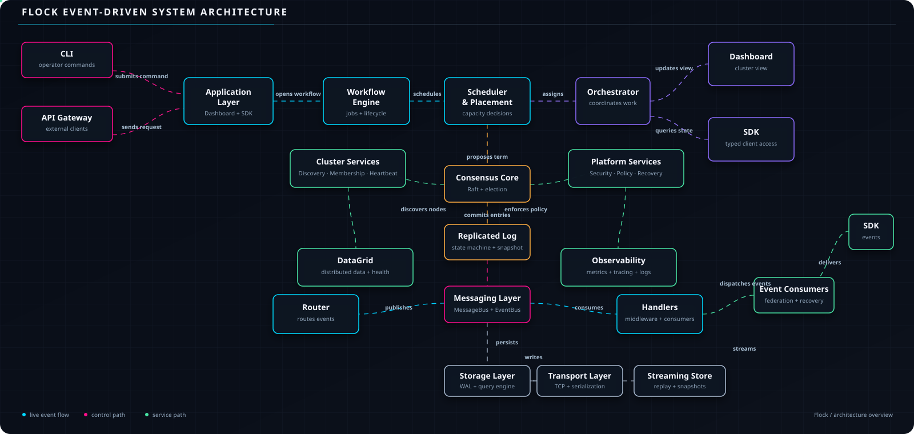

<div align="center">


# 🐦 Flock &nbsp;•&nbsp; A Distributed Computing Framework for Python

<br>

<table>
<tr>
<td align="center">

[](https://pypi.org/project/flock-p2p/)

</td>
<td align="center">

[](https://pypi.org/project/flock-p2p/)

</td>
<td align="center">

[](https://pepy.tech/project/flock-p2p)

</td>
</tr>
<tr>
<td align="center">

[](LICENSE)

</td>
<td align="center">

[](https://github.com/Ashish6298/Flock/actions)

</td>
<td align="center">

[](#testing)

</td>
</tr>
</table>

[**Get Started**](#-installation) &nbsp;•&nbsp; [Quick Start](#-quick-start) &nbsp;•&nbsp; [Architecture](#%EF%B8%8F-architecture) &nbsp;•&nbsp; [API Reference](#-api-reference) &nbsp;•&nbsp; [Configuration](#%EF%B8%8F-configuration)

</div>

<br>

## Overview

Flock is a fully-typed Python framework for building systems that run across multiple machines. It bundles the components a distributed system normally needs — Raft consensus, leader election, cluster membership, a message bus, scheduling, and security — into one importable package, so you wire up services with dependency injection instead of standing up separate infrastructure.

It's built around 43 focused subsystems (`flock.consensus`, `flock.scheduler`, `flock.security`, `flock.workflow`, and others), each independently testable and typed under `mypy --strict`.

| | |
|---|---|
| **Language** | Python 3.11+ |
| **Core dependency footprint** | `pydantic`, `structlog`, `msgpack` |
| **Consensus model** | Raft (leader election, log replication, snapshots) |
| **Transport** | Pluggable — TCP built in |
| **Install** | `pip install flock-p2p` |

<br>

## What's New in Flock v1.2.0

Flock v1.2.0 introduces **Performance & Observability**, bringing a complete performance monitoring, profiling, and regression detection suite designed to analyze, monitor, and optimize your distributed clusters passively:

- ⚡ **Performance Foundation (Speed Measurement)**: Easily measure how fast your code runs. Use timing decorators (`@time_execution`) to track execution times and run tests (`BenchmarkEngine`) to see how much throughput your servers can handle.

- 🔍 **Runtime Profiling (Resource Analysis)**: See exactly where your app is spending its time and memory. It identifies slow parts of your code (hotspots) and tracks memory allocation deltas without slowing down your production environment.

- 📉 **Regression Detection (Slowdown Prevention)**: Save a benchmark as a "baseline" when your app is running perfectly. Flock will automatically compare future runs against this baseline to warn you if a new code update makes the app slower.

- 🎯 **Performance Optimization (Smart Suggestions)**: Get automated recommendations on what to fix. The engine scans your performance data and highlights critical bottlenecks ranked by priority (Critical, High, Medium, Low).

- 📊 **Performance Monitoring (Real-time Health)**: View a live health status (Healthy, Degraded, Critical) of your cluster. It watches system metrics in real time and raises warnings if things slow down.

- 📋 **Performance Reporting (Release Scorecards)**: Generate a simple performance scorecard (grades A to F) and readiness certificate to confirm if your app is ready and safe to release to users.

<br>


## Table of Contents
<table width="1000">
<tr>
<td width="330" valign="top">

<b>🚀 Getting Started</b>

- [Overview](#overview)
- [Why Flock](#why-flock)
- [Features](#features)
- [Installation](#installation)
- [Quick Start](#quick-start)

</td>

<td width="340" valign="top">

<b>🏗️ Reference</b>

- [Architecture](#architecture)
- [Subsystems](#subsystems)
- [API Reference](#api-reference)
- [Configuration](#configuration)
- [Examples](#examples)

</td>

<td width="330" valign="top">

<b>📦 Project</b>

- [Testing](#testing)
- [Contributing](#contributing)
- [Security](#security)
- [License](#license)
- [Citation](#citation)

</td>
</tr>
</table>

<br>

## The Story Behind Flock

<div align="center">

### 💡 A single computer is no longer enough.

</div>

Whether it's traffic outgrowing one server, data too big for one machine, or uptime that can't depend on a single point of failure — the fix is always the same: run your software across **multiple computers working together as one.**

That's **distributed computing**. It quietly powers Netflix, Google, WhatsApp, and Uber. But here's what most tutorials leave out:

> ### "Building a distributed system from scratch is one of the hardest things in software engineering."

<br>

<table width="100%">
<tr>
<td align="center" width="20%">

**🩹**
**Fault Tolerance**

<sub>What happens when a server crashes mid-op?</sub>

</td>
<td align="center" width="20%">

**👑**
**Leader Election**

<sub>Who's in charge, with no single source of truth?</sub>

</td>
<td align="center" width="20%">

**🔄**
**Consistency**

<sub>How do 5 machines agree on the same data?</sub>

</td>
<td align="center" width="20%">

**🔒**
**Security**

<sub>How do you stop traffic interception?</sub>

</td>
<td align="center" width="20%">

**📊**
**Observability**

<sub>How do you catch failures before users do?</sub>

</td>
</tr>
</table>

<br>

These problems have occupied computer scientists for decades. Google and Amazon threw years of engineering effort at solving them internally — most teams don't have that runway.

**That's why Flock exists** — one `pip install` for infrastructure that used to take enterprise teams years to build.

<details>
<summary><b>📖 Read the full story</b></summary>
<br>

Flock was born from a simple frustration: developers shouldn't have to spend months building infrastructure before they can start building their actual product — especially when the Python ecosystem had no single, cohesive package that solved this.

The tools that solve consensus, replication, security, and observability have always existed — but scattered across research papers, expensive enterprise platforms, or locked inside the infrastructure teams of large tech companies. Nothing brought them together for the average Python developer.

Flock closes that gap: open-source, fully typed, and built to give any developer the same caliber of distributed-systems infrastructure that used to be exclusive to the biggest engineering teams in the world.

</details>

<br>

## What Problem Does Flock Solve?

Flock provides a **complete distributed systems stack** in Python — mapping familiar real-world problems to concrete solutions:

| Real-World Problem | Computer Science Term | Flock Solution |
|---|---|---|
| Who is in charge? | Leader Election | `ConsensusService` (Raft algorithm) |
| Stay online when a server dies | Fault Tolerance | Automatic failover + replication |
| All servers agree on the same data | Consensus | Raft log replication + state machine |
| Prevent data loss on crashes | Durability | Write-Ahead Log (WAL) + snapshots |
| Find other servers automatically | Service Discovery | `DiscoveryService` |
| Secure communication | mTLS / Zero-Trust | `SecurityService` |
| Know when things go wrong | Observability | Metrics, tracing, alerts, dashboards |
| Scale up when traffic spikes | Autoscaling | AI-powered `OrchestratorService` |
| Run jobs across many servers | Distributed Scheduling | `SchedulerService` + `PlacementEngine` |
| Recover from disasters | Disaster Recovery | `RecoveryService` with backups + PITR |

<details>
<summary><b>🍳 Prefer an analogy? The Restaurant Kitchen Problem</b></summary>
<br>

Imagine running a restaurant. On a quiet Tuesday, one chef handles everything. On a Friday night with 200 customers, that one chef becomes a bottleneck — you need **multiple chefs working together**, which raises new problems:

- **Who's the head chef**, and who takes over if they go home sick? → *leader election*
- **A chef drops a dish mid-prep** — who picks it up where it was left off? → *fault tolerance*
- **How do two chefs avoid cooking the same order twice?** → *consensus*
- **How do you stop the dishwasher from accessing the safe?** → *security & RBAC*
- **How do you know which chef is overloaded, in real time?** → *observability*

Flock solves all of these — not for kitchens, but for any system that needs to run across multiple servers.

</details>

<br>

## Who Is Flock For?

Flock scales from a student reading source code for the first time to an enterprise team running hundreds of clusters.

<table width="100%">
<tr>
<td align="center" width="18%">🎓 Students & Learners</td>
<td align="center" width="23%">👨‍💻 Developers & Side Projects</td>
<td align="center" width="21%">🏢 Startups & Small Teams</td>
<td align="center" width="15%">🏭 Enterprise</td>
<td align="center" width="25%">🔬 Researchers & Data Scientists</td>
</tr>
</table>

<br>

<details>
<summary><b>🎓 Students & Learners</b></summary>
<br>

See a *real*, working implementation of Raft consensus, leader election, distributed state machines, and service meshes — not just theory. Every subsystem is documented, strictly typed, and built to textbook standards, so the source code doubles as a reference implementation.

```bash
pip install flock-p2p
python -c "from flock.consensus import ConsensusService; help(ConsensusService)"
```

</details>

<details>
<summary><b>👨‍💻 Individual Developers & Side Projects</b></summary>
<br>

Skip weeks of reading consensus papers and debugging race conditions — install Flock and have a working distributed foundation in an afternoon.

**Use cases:** personal projects outgrowing a single VPS · home lab clusters (Raspberry Pi farms) · distributed data pipelines · multiplayer game server backends · distributed web scrapers

</details>

<details>
<summary><b>🏢 Startups & Small Engineering Teams</b></summary>
<br>

A team of 2–5 engineers doesn't need to become distributed-systems experts to run production infrastructure. Consensus, replication, security, and observability are already solved.

**Use cases:** multi-region SaaS deployment · distributed task queues with guaranteed execution · real-time multi-node data processing · highly available APIs with automatic failover

</details>

<details>
<summary><b>🏭 Enterprise & Large Organizations</b></summary>
<br>

Built-in support for multi-cloud federation, policy-as-code governance, compliance auditing, fleet management, RBAC, secrets vaulting, and intrusion detection — capabilities most companies otherwise build in-house over years.

**Use cases:** multi-cloud infrastructure across AWS/GCP/Azure · compliance auditing (HIPAA, SOC2) · fleet management across hundreds of nodes · disaster recovery with point-in-time restore · policy-enforced workload governance

</details>

<details>
<summary><b>🔬 Researchers & Data Scientists</b></summary>
<br>

Distribute an ML training job across multiple GPUs or machines, or build a data pipeline that processes terabytes of data — Flock provides the distributed execution substrate so you can focus on the algorithm, not the infrastructure.

</details>

<br>

## How Does Flock Help You?

### The Traditional Approach (Without Flock)

Building the same distributed foundation from scratch typically looks like this:

| Timeline | What You're Building | The Hard Part |
|---|---|---|
| **Month 1–2** | A consensus algorithm (Raft or Paxos) | Debugging election edge cases, split-brain scenarios |
| **Month 3** | A membership registry | Heartbeats, node join/leave, network partitions |
| **Month 4** | A message bus | Protocol design, serialization, versioning, backward compatibility |
| **Month 5–6** | Security | TLS, authentication, authorization, secrets management |
| **Month 7–8** | Observability | Metrics collection, distributed tracing, alerting |
| **Month 9+** | *Finally* — your actual product | — |

<div align="center">

**⏱️ ~9 months before writing a single line of business logic — for a skilled team.**

</div>

<br>

## The Flock Approach

```bash
pip install flock-p2p   # 30 seconds
```

```python
# A few minutes to a working distributed system
from flock.consensus import ConsensusService
from flock.events.bus import EventBus
from flock.messaging.bus import MessageBus

consensus = ConsensusService("node-1", membership, message_bus, event_bus)
await consensus.start()

# You now have Raft consensus, leader election, log replication,
# fault tolerance, and event publishing. Start building your product.
```

<div align="center">

**⏱️ Time to a working distributed foundation: under an hour.**

</div>

<br>

### The Difference, By the Numbers

| Metric | Build Yourself | With Flock |
|---|---|---|
| Time to first working cluster | Months | Minutes |
| Infrastructure code you maintain | Thousands of lines | Already written |
| Test coverage for edge cases | You write it all | 663 tests included |
| Consensus algorithm correctness | Your responsibility | Implemented Raft, unit-tested |
| Security posture | Your responsibility | Built-in mTLS, RBAC, secrets vault |
| Ongoing maintenance | On you | Shared with the OSS community |

<br>

## ✨ Features

<div align="left">

### **CORE PLATFORM**

</div>
<div align="center">
</tr></table>
</div>
<br>
<table width="100%">
<tr>
<td align="center" width="20%">

### ⚡ **Full Raft Consensus**

<sub>Leader election, log replication, state machine, term management, log compaction</sub>

</td>
<td align="center" width="20%">

### 🌐 **Cluster Membership**

<sub>Node discovery, heartbeat health monitoring, live membership registry</sub>

</td>
<td align="center" width="20%">

### 🔄 **Distributed State Machine**

<sub>Consistent replicated state with snapshotting and WAL</sub>

</td>
<td align="center" width="20%">

### 📡 **Transport-Independent Messaging**

<sub>Pluggable transport (TCP built-in); typed message routing</sub>

</td>
<td align="center" width="20%">

### 🗂️ **DataGrid**

<sub>In-memory distributed KV store — replication, partitioning, failover</sub>

</td>
</tr>
</table>

<br>

<div align="left">

### **EXECUTION & SCHEDULING**

</div>
<br>
<table width="100%">
<tr>
<td align="center" width="25%">

### 🧠 **AI-Powered Orchestration**

<sub>ML-based placement, predictive autoscaling, anomaly detection</sub>

</td>
<td align="center" width="25%">

### 📋 **Workflow Engine**

<sub>DAG workflows with checkpointing, parallelism, failure recovery</sub>

</td>
<td align="center" width="25%">

### ⏰ **Advanced Scheduler**

<sub>Cron, event-driven, deadline-aware scheduling</sub>

</td>
<td align="center" width="25%">

### 🎯 **Constraint-Aware Placement**

<sub>CPU/memory/affinity/anti-affinity placement engine</sub>

</td>
</tr>
</table>

<br>

<div align="left">

### **ENTERPRISE INFRASTRUCTURE**

</div>
<br>
<table width="100%">
<tr>
<td align="center" width="33%">

### 🔒 **Zero-Trust Security**

<sub>mTLS, RBAC, certificate management, credential rotation, intrusion detection</sub>

</td>
<td align="center" width="33%">

### 🛡️ **Secrets Vault**

<sub>Encrypted storage, key rotation, compliance auditing</sub>

</td>
<td align="center" width="33%">

### 📊 **Full Observability**

<sub>Tracing, structured logging, metrics, alerts, profiling, dashboards</sub>

</td>
</tr>
<tr>
<td align="center" width="33%">

### 🌍 **Multi-Cloud Federation**

<sub>Cross-region federation, latency-aware routing, trust handshakes</sub>

</td>
<td align="center" width="33%">

### 🏛️ **Control Plane**

<sub>Fleet management, cluster enrollment, org governance</sub>

</td>
<td align="center" width="33%">

### 📜 **Policy-as-Code**

<sub>Declarative policy compiler, rule engine, compliance enforcement</sub>

</td>
</tr>
<tr>
<td align="center" width="33%">

### 💾 **Disaster Recovery**

<sub>Automated snapshots, incremental backups, PITR restore</sub>

</td>
<td align="center" width="33%">

### 🛒 **Plugin Marketplace**

<sub>Package registry, dependency resolution, sandboxed execution</sub>

</td>
<td align="center" width="33%">

### 🚀 **Deployment Automation**

<sub>Docker/K8s manifests, rolling updates, rollback</sub>

</td>
</tr>
</table>

<br>

<div align="left">

### **DEVELOPER EXPERIENCE**

</div>

<table width="100%">
<tr>
<td align="center" width="20%">

### ✅ **635 Tests**

<sub>Full regression coverage, 42 subsystems</sub>

</td>
<td align="center" width="20%">

### 🔤 **Fully Typed**

<sub>`mypy --strict` clean, 390 source files</sub>

</td>
<td align="center" width="20%">

### 📦 **Single Install**

<sub>`pip install flock-p2p`</sub>

</td>
<td align="center" width="20%">

### 🖥️ **TUI Dashboard**

<sub>Keyboard-driven CLI dashboard (`flock`)</sub>

</td>
<td align="center" width="20%">

### 🐍 **Python 3.11+**

<sub>Modern Python, no legacy baggage</sub>

</td>
</tr>
</table>

<br>

## 📦 Installation

<div align="left">

```bash
pip install flock-p2p
```

</div>

### 🖥️ Interactive CLI Dashboard

Once installed, you can immediately launch the interactive TUI onboarding dashboard by running:

```bash
flock
```

This starts a keyboard-driven, in-place terminal dashboard that lets you run diagnostics, launch local cluster simulations, view examples, check version details, and access documentation.

### Requirements

| Dependency | Version | Purpose |
|---|---|---|
| **Python** | ≥ 3.11 | Runtime |
| `pydantic` | ≥ 2.0.0 | Data validation and models |
| `structlog` | ≥ 23.1.0 | Structured logging |
| `msgpack` | ≥ 1.0.0 | Binary serialization |

<br>

### Development Installation

For contributing or running the test suite locally:

**1. Clone the repository**
```bash
git clone https://github.com/Ashish6298/Flock.git
```

**2. Enter the project directory**
```bash
cd Flock
```

**3. Install in editable mode with dev dependencies**
```bash
pip install -e .[dev]
```

<sub>Dev extras include: `pytest` · `pytest-asyncio` · `mypy` · `black` · `ruff`</sub>

<br>

## 🚀 Quick Start  &nbsp;•&nbsp;  **Three examples. Each one runnable in under a minute.**

<table width="100%">
<tr>
<td align="center" width="33%">

### **🧱 Start a Cluster**
<sub>Raft consensus, leader election</sub>
</td>
<td align="center" width="33%">

### **🏛️ Join the Control Plane**
<sub>Fleet enrollment & governance</sub>
</td>
<td align="center" width="33%">

### **📋 Submit a Workflow**
<sub>DAG-based task execution</sub>
</td>
</tr>
</table>


---


### 1️⃣ Start a Single-Node Cluster

<sub>Spin up Raft consensus, elect a leader, and commit your first log entry.</sub>

<details open>
<summary><b>Show code</b></summary>
<br>

```python
import asyncio
from unittest.mock import MagicMock
from flock.events.bus import EventBus
from flock.messaging.bus import MessageBus
from flock.consensus import ConsensusService
from flock.cluster.registry import MembershipRegistry
from flock.cluster.models import NodeMember, ClusterMemberStatus

async def main() -> None:
    # Wire up core infrastructure
    event_bus = EventBus()
    transport = MagicMock()       # Replace with TCPTransport in production
    serializer = MagicMock()      # Replace with JsonSerializer in production
    message_bus = MessageBus(transport, serializer)

    # Build membership registry
    registry = MembershipRegistry()
    registry.register(NodeMember(
        node_id="node-1",
        host="127.0.0.1",
        port=9000,
        status=ClusterMemberStatus.ACTIVE,
    ))

    # Start Raft consensus
    consensus = ConsensusService(
        node_id="node-1",
        membership=registry,
        message_bus=message_bus,
        event_bus=event_bus,
    )
    await consensus.start()

    # Submit a command (only succeeds if this node is the leader)
    if consensus.is_leader():
        entry = await consensus.submit_command(b"hello-world")
        print(f"Committed log entry: {entry}")

    await consensus.stop()

asyncio.run(main())
```

</details>

<br>

### 2️⃣ Register a Cluster with the Control Plane

<sub>Enroll a cluster into a fleet with labels, versioning, and active feature tracking.</sub>

<details>
<summary><b>Show code</b></summary>
<br>

```python
import asyncio
from flock.events.bus import EventBus
from flock.messaging.bus import MessageBus
from flock.controlplane.service import ControlPlaneService
from flock.controlplane.models import EnrolledCluster
from unittest.mock import MagicMock

async def main() -> None:
    event_bus = EventBus()
    message_bus = MessageBus(MagicMock(), MagicMock())

    cp = ControlPlaneService(
        node_id="coordinator",
        message_bus=message_bus,
        event_bus=event_bus,
    )
    await cp.start()

    cluster = EnrolledCluster(
        cluster_id="cluster-east",
        fleet_id="fleet-prod",
        name="US East Compute",
        version="1.0.0",
        labels={"region": "us-east-1", "tier": "prod"},
        features_active=["Consensus", "Security", "Observability"],
        last_seen=0.0,
    )
    cp.coordinator.clusters.enroll_cluster(cluster)
    print(f"Cluster enrolled: {cluster.name}")

    await cp.stop()

asyncio.run(main())
```

</details>

<br>

### 3️⃣ Submit a Distributed Workflow

<sub>Define a DAG with dependencies and submit it for checkpointed execution.</sub>

<details>
<summary><b>Show code</b></summary>
<br>

```python
import asyncio
from flock.workflow.service import WorkflowService
from flock.workflow.models import WorkflowDefinition, WorkflowStep
from flock.events.bus import EventBus
from flock.messaging.bus import MessageBus
from flock.storage.backend import StorageBackend
from unittest.mock import MagicMock

async def main() -> None:
    storage = StorageBackend()
    event_bus = EventBus()
    message_bus = MessageBus(MagicMock(), MagicMock())

    workflow_svc = WorkflowService(
        node_id="node-1",
        storage_backend=storage,
        message_bus=message_bus,
        event_bus=event_bus,
    )
    await workflow_svc.start()

    # Define a two-step DAG workflow
    wf = WorkflowDefinition(
        workflow_id="wf-001",
        name="data-pipeline",
        steps=[
            WorkflowStep(step_id="ingest", name="Ingest Data", dependencies=[]),
            WorkflowStep(step_id="transform", name="Transform", dependencies=["ingest"]),
        ],
    )
    await workflow_svc.submit(wf)
    await workflow_svc.stop()

asyncio.run(main())
```

</details>

<br>


## 🏗️ Architecture

Flock is a distributed, event-driven platform built around a strong consistency core.
The architecture connects application interfaces, coordination services, cluster nodes,
and persistence layers through a unified event graph.

<p align="center">
  
</p>

<br>

# ✨ Design Principles

> *A great architecture isn't defined by frameworks—it's defined by the principles that guide every design decision.*

These core principles ensure the system remains **modular**, **scalable**, **maintainable**, and **easy to evolve** as new requirements emerge.

---

# Transport Independence

> **Build once. Change the transport anytime.**

Business logic communicates exclusively through the **`MessageBus`**, never with TCP, UDP, gRPC, WebSockets, or any other transport directly.

The transport layer becomes an implementation detail—not a dependency.

### ✅ Why it matters

* Switch communication protocols without touching business logic
* Use an in-memory transport for lightning-fast tests
* Keep networking concerns isolated from the domain
* Add new transports with minimal effort

> 💡 **Guiding Principle**
> **Infrastructure should be replaceable without affecting domain logic.**

---

# Event-Driven Architecture

> **Components react to events—not to each other.**

Every meaningful state transition publishes a **strongly typed event** through the **`EventBus`**.

Any number of subscribers can respond independently, allowing the system to grow without creating tight coupling.

### 🔄 How it works

```text
Service A
    │
    ▼
Publishes Event
    │
    ▼
┌──────────────┬──────────────┬──────────────┐
│ Subscriber A │ Subscriber B │ Subscriber C │
└──────────────┴──────────────┴──────────────┘
```

### ✅ Why it matters

* Loose coupling between components
* Add new features without modifying existing services
* Natural support for asynchronous workflows
* Independent testing of event handlers

> 💡 **Guiding Principle**
> **Publish events instead of invoking services directly.**

---

# Immutable Domain Models

> **State is created—not modified.**

Every domain object is implemented using:

```python
@dataclass(frozen=True)
```

Instead of changing existing objects, each state transition creates a **new immutable instance** representing the updated state.

### 🔄 Example

```text
Order(status="Pending")
          │
          ▼
Order(status="Shipped")
```

The original object remains unchanged.

### ✅ Why it matters

* Predictable behavior
* Safer concurrent execution
* Easier debugging
* Fewer unintended side effects

> 💡 **Guiding Principle**
> **Domain objects represent values—not mutable state.**

---

# Thread Safety

> **Concurrency is a design requirement—not an afterthought.**

Whenever shared mutable state exists, access is synchronized using:

```python
threading.RLock()
```

This guarantees correctness even under concurrent workloads.

### ✅ Why it matters

* Prevent race conditions
* Preserve consistent application state
* Safe multi-threaded execution
* Reliable behavior under load

> 💡 **Guiding Principle**
> **Shared mutable state must always be synchronized.**

---

# SOLID & Dependency Inversion

> **Depend on abstractions—not implementations.**

Services receive all dependencies through **constructor injection**, rather than creating infrastructure internally.

This clean separation keeps business logic independent from implementation details.

### 🔄 Dependency Flow

```text
Business Service
       │
       ▼
Interface (Abstraction)
       │
       ▼
Concrete Implementation
```

### ✅ Why it matters

* Highly testable services
* Easily replace implementations
* Clear separation of concerns
* Long-term maintainability

> 💡 **Guiding Principle**
> **Services should never construct their own infrastructure.**

---

# Principles at a Glance

| Principle                            | Purpose                                                                |
| ------------------------------------ | ---------------------------------------------------------------------- |
| **Transport Independence**        | Decouple communication from transport protocols.                       |
| **Event-Driven Architecture**      | Enable collaboration through published events instead of direct calls. |
| **Immutable Domain Models**       | Create predictable, side-effect-free state transitions.                |
| **Thread Safety**                | Ensure correctness under concurrent execution.                         |
| **SOLID & Dependency Inversion** | Keep services modular, testable, and infrastructure-agnostic.          |

---

# How They Work Together

```text
                +--------------------+
                |   Business Logic   |
                +---------+----------+
                          │
          depends only on abstractions
                          │
                          ▼
                 +----------------+
                 |  Message Bus   |
                 +-------+--------+
                         │
        publishes events │
                         ▼
                 +----------------+
                 |   Event Bus    |
                 +-------+--------+
                         │
          ┌──────────────┼──────────────┐
          ▼              ▼              ▼
     Service A      Service B      Service C
          │              │              │
          └──────────────┼──────────────┘
                         ▼
                Immutable Domain Models
                         │
                Thread-safe execution
```

---

# The Bigger Picture

Each principle reinforces the others:

* **Transport Independence** keeps infrastructure replaceable.
* **Events** keep services loosely coupled.
* **Immutability** makes state predictable.
* **Thread Safety** ensures correctness under concurrency.
* **Dependency Inversion** keeps the architecture clean and testable.

Together, they create a system that is:

> **Modular • Scalable • Resilient • Testable • Extensible • Future-Proof**
>
> 💙 **Good architecture isn't about making today's code work—it's about making tomorrow's changes effortless.**

<br>

# 🧩 Flock Subsystems

<br>

> **Flock is composed of 42 focused subsystems.**
>
> Each subsystem has a single responsibility and can evolve independently while collaborating through shared interfaces and the event-driven architecture.

<br>

# 🏗️ Core Distributed Systems
<br>
The foundation of the cluster.

| Subsystem         | Module            | Responsibility                                                             |
| ----------------- | ----------------- | -------------------------------------------------------------------------- |
| 🗳️ **Consensus** | `flock.consensus` | Raft consensus, leader election, log replication, replicated state machine |
| 🏛️ **Cluster**   | `flock.cluster`   | Node membership, registry, health management                               |
| ❤️ **Heartbeat**  | `flock.heartbeat` | Failure detection and peer liveness monitoring                             |
| 🔍 **Discovery**  | `flock.discovery` | Service registration and peer discovery                                    |
| 🌐 **Transport**  | `flock.transport` | Pluggable network transport (TCP and future transports)                    |
| 📦 **Protocol**   | `flock.protocol`  | Typed protocol messages and `MessageType` definitions                      |

<br>

# 💬 Communication Layer
<br>
Everything related to messaging and event distribution.

| Subsystem        | Module            | Responsibility                                |
| ---------------- | ----------------- | --------------------------------------------- |
| 📨 **Messaging** | `flock.messaging` | MessageBus, routing, middleware, handlers     |
| ⚡ **Events**     | `flock.events`    | EventBus for publish/subscribe communication  |
| 🌊 **Streaming** | `flock.streaming` | Distributed event streaming with backpressure |

<br>

# 💾 Data & Storage
<br>
Persistent and distributed data management.

| Subsystem            | Module                | Responsibility                                  |
| -------------------- | --------------------- | ----------------------------------------------- |
| 🗄️ **DataGrid**     | `flock.datagrid`      | Distributed key-value storage with partitioning |
| 💽 **Storage**       | `flock.storage`       | WAL, persistence, recovery                      |
| 📸 **Snapshot**      | `flock.snapshot`      | Snapshotting, compaction, replication           |
| 🔄 **State Machine** | `flock.statemachine`  | Generic replicated state machine                |
| 📑 **Serialization** | `flock.serialization` | JSON and MessagePack serialization              |

<br>

# ⚙️ Runtime & Scheduling
<br>
Task execution and workload management.

| Subsystem         | Module             | Responsibility                             |
| ----------------- | ------------------ | ------------------------------------------ |
| 🚀 **Runtime**    | `flock.runtime`    | Execution context and runtime environment  |
| ⏱️ **Scheduler**  | `flock.scheduler`  | Priority-based task scheduling             |
| 📅 **Scheduling** | `flock.scheduling` | Cron, triggers, deadlines, recurring jobs  |
| 📋 **Results**    | `flock.results`    | Result collection, serialization, registry |

<br>

# ☁️ Distributed Compute
<br>
Cluster-wide execution and orchestration.

| Subsystem           | Module               | Responsibility                                     |
| ------------------- | -------------------- | -------------------------------------------------- |
| 🤖 **Orchestrator** | `flock.orchestrator` | AI-assisted workload orchestration and autoscaling |
| 📍 **Placement**    | `flock.placement`    | Constraint-aware workload placement                |
| 🧠 **Resources**    | `flock.resources`    | CPU, memory, balancing, capacity planning          |
| 🔀 **Workflow**     | `flock.workflow`     | DAG workflow engine with checkpointing             |
| ⚡ **Functions**     | `flock.functions`    | Serverless function execution                      |

<br>

# 🌐 Networking & Services
<br>
Application networking capabilities.

| Subsystem    | Module        | Responsibility                                          |
| ------------ | ------------- | ------------------------------------------------------- |
| 🕸️ **Mesh** | `flock.mesh`  | Service mesh, routing, circuit breaking, load balancing |
| 🔍 **Query** | `flock.query` | Distributed query parser, planner, optimizer            |

<br>

# 📊 Operations & Monitoring
<br>
Visibility into the running cluster.

| Subsystem            | Module                | Responsibility                               |
| -------------------- | --------------------- | -------------------------------------------- |
| 📈 **Observability** | `flock.observability` | Metrics, tracing, profiling, alerts, logging |
| ⚡ **Performance**   | `flock.performance`   | High-resolution timing, profiling, regression checks, and engineering reporting |
| 📺 **Dashboard**     | `flock.dashboard`     | Real-time operational dashboard              |

<br>

# 🔐 Security & Governance
<br>
Securing and governing the platform.

| Subsystem             | Module               | Responsibility                                 |
| --------------------- | -------------------- | ---------------------------------------------- |
| 🛡️ **Security**      | `flock.security`     | Zero-Trust security, RBAC, vault, cryptography |
| 📜 **Policy**         | `flock.policy`       | Policy-as-Code, compliance, rule engine        |
| 🎛️ **Control Plane** | `flock.controlplane` | Fleet management and cluster governance        |

<br>

# 🤖 Intelligence
<br>
Machine learning and predictive capabilities.

| Subsystem | Module     | Responsibility                                   |
| --------- | ---------- | ------------------------------------------------ |
| 🧠 **AI** | `flock.ai` | Prediction, anomaly detection, adaptive learning |

<br>

# 🌍 Enterprise & Cloud
<br>
Large-scale deployment capabilities.

| Subsystem         | Module             | Responsibility                                   |
| ----------------- | ------------------ | ------------------------------------------------ |
| 🌐 **Federation** | `flock.federation` | Multi-region and multi-cloud federation          |
| 🚑 **Recovery**   | `flock.recovery`   | Disaster recovery, backup, point-in-time restore |
| 🚀 **Deployment** | `flock.deployment` | Kubernetes and Docker deployment automation      |
| 📦 **Release**    | `flock.release`    | Release lifecycle and production readiness       |

<br>

# 🔌 Extensibility
<br>
Customize and extend Flock.

| Subsystem          | Module              | Responsibility                                      |
| ------------------ | ------------------- | --------------------------------------------------- |
| 🛒 **Marketplace** | `flock.marketplace` | Plugin registry, dependency resolution, sandboxing  |
| 🧩 **Plugins**     | `flock.plugins`     | Plugin loading, lifecycle, isolation                |
| 🔗 **Interfaces**  | `flock.interfaces`  | Shared interfaces, abstract base classes, protocols |

<br>

# 🛠️ Developer Experience
<br>
Developer-facing tools.

| Subsystem     | Module         | Responsibility            |
| ------------- | -------------- | ------------------------- |
| ⚙️ **Config** | `flock.config` | Configuration management  |
| 🌐 **API**    | `flock.api`    | HTTP gateway and REST API |
| 💻 **CLI**    | `flock.cli`    | Command-line interface    |

<br>

# 📦 Architecture Map
<br>

```text
                              FLOCK
                                │
 ┌─────────────────────────────────────────────────────────────┐
 │                  Core Distributed Systems                   │
 └─────────────────────────────────────────────────────────────┘
            │
            ├── 💬 Communication
            ├── 💾 Data & Storage
            ├── ⚙️ Runtime & Scheduling
            ├── ☁️ Distributed Compute
            ├── 🌐 Networking
            ├── 📊 Observability
            ├── 🔐 Security & Governance
            ├── 🤖 AI
            ├── 🌍 Enterprise
            ├── 🔌 Extensibility
            └── 🛠️ Developer Experience
```

<br>

## 📈 At a Glance

<br>

| Category                     | Modules |
| ---------------------------- | :-----: |
| 🏗️ Core Distributed Systems |  **6**  |
| 💬 Communication             |  **3**  |
| 💾 Data & Storage            |  **5**  |
| ⚙️ Runtime & Scheduling      |  **4**  |
| ☁️ Distributed Compute       |  **5**  |
| 🌐 Networking                |  **2**  |
| 📊 Operations                |  **3**  |
| 🔐 Security & Governance     |  **3**  |
| 🤖 Intelligence              |  **1**  |
| 🌍 Enterprise                |  **4**  |
| 🔌 Extensibility             |  **3**  |
| 🛠️ Developer Experience     |  **3**  |

<br>

> **43 focused subsystems working together to provide a modular, scalable, distributed application platform.**


<br>

# 📚 API Reference

<br>

> The Flock API is **asynchronous**, **strongly typed**, and **modular**. Expand any section below to explore its API, methods, and examples.

<br>


<details open>
<summary><strong>Core Types</strong> — Immutable domain models that represent nodes, tasks, and shared entities used throughout the Flock ecosystem.</summary>

### NodeInfo

```python
from flock import NodeInfo

node = NodeInfo(
    node_id="node-1",
    host="10.0.0.1",
    port=9000,
    metadata={"zone": "us-east-1a"},
)
```

### TaskSpec

```python
from flock import TaskSpec

task = TaskSpec.create(
    "process_batch",
    dataset="sales_q4",
    limit=1000,
)
```

### TaskStatus

```python
class TaskStatus(str, Enum):
    PENDING = "PENDING"
    RUNNING = "RUNNING"
    COMPLETED = "COMPLETED"
    FAILED = "FAILED"
    CANCELLED = "CANCELLED"
```

</details>

<br>

<details>
<summary><strong>ConsensusService</strong> — Implements the Raft consensus algorithm for leader election, replicated logs, and distributed state consistency.</summary>

### Create a service

```python
from flock.consensus import ConsensusService

service = ConsensusService(...)
```

### Start

```python
await service.start()
await service.stop()
```

### Cluster State

```python
service.is_leader()
service.current_term
service.leader_id
```

### Submit Command

```python
entry = await service.submit_command(
    b"payload"
)
```

### Published Events

| Event                          | Description          |
| ------------------------------ | -------------------- |
| `consensus.leader.elected`     | Leader elected       |
| `consensus.term.changed`       | Current term changed |
| `consensus.log.committed`      | Log committed        |
| `consensus.replication.failed` | Replication failure  |

</details>

<br>

<details>
<summary><strong>SecurityService</strong> — Provides authentication, authorization, cryptographic operations, identity management, and secure secret storage.</summary>

### Initialize

```python
from flock.security.service import SecurityService

service = SecurityService(...)
```

### Authenticate

```python
service.authentication_engine.authenticate(
    token,
    peer_id,
)
```

### Authorize

```python
service.authorization_engine.authorize(
    identity,
    "write",
    "resource",
)
```

### Secrets

```python
service.secrets_manager.store(
    "db_password",
    b"secret",
)

secret = service.secrets_manager.retrieve(
    "db_password",
)
```

</details>

<br>

<details>
<summary><strong>WorkflowService</strong> — Executes distributed DAG workflows with dependency management, checkpointing, and fault recovery.</summary>

### Create Service

```python
from flock.workflow.service import WorkflowService

service = WorkflowService(...)
```

### Submit Workflow

```python
await service.submit(workflow)
```

</details>

<br>

<details>
<summary><strong>EventBus</strong> — Enables loosely coupled publish/subscribe communication between independent services and subsystems.</summary>

### Subscribe

```python
from flock.events.bus import EventBus

bus = EventBus()

bus.subscribe(
    "consensus.leader.elected",
    callback,
)
```

### Publish

```python
bus.publish(
    "consensus.leader.elected",
    payload,
)
```

</details>

<br>

<details>
<summary><strong>MessageBus</strong> — Provides transport-independent, strongly typed messaging with routing, middleware, and asynchronous delivery.</summary>

### Register Handler

```python
from flock.messaging.bus import MessageBus
from flock.protocol.packet import MessageType

@bus.handler(MessageType.VOTE_REQUEST)
async def handle_vote(message):
    ...
```

### Send Message

```python
await bus.send(
    peer_id="node-2",
    message_type=MessageType.HEARTBEAT,
    payload=b"...",
)
```

</details>

<br>

## API Design Principles

<br>

Every public API in Flock follows the same architectural philosophy:

* **Immutable Models** — Domain objects are value types that never mutate.
* **Async First** — Network and I/O operations use `async` / `await`.
* **Event Driven** — Components collaborate through published events.
* **Strongly Typed** — APIs expose explicit types, enums, and contracts.
* **Transport Independent** — Business logic is isolated from networking protocols.
* **Dependency Injection** — Infrastructure is supplied externally for flexibility and testability.

<br>

> **The API is intentionally consistent across every subsystem, making it easy to learn, extend, and scale distributed applications with Flock.**

<br>

# ⚙️ Configuration

<br>

> Flock follows an **explicit configuration model**. Services are configured entirely through **constructor arguments** and **dependency injection**—there are **no global configuration files, hidden state, or singleton objects**.

This approach keeps every subsystem **modular**, **testable**, and **easy to replace** while making dependencies explicit.

<br>

## ✨ Configuration Philosophy

* 🧩 **Dependency Injection** — Services receive their dependencies through constructors.
* 🚫 **No Global State** — No global configuration objects or singletons.
* 🔒 **Explicit Dependencies** — Every required component is visible in the constructor.
* 🧪 **Test Friendly** — Infrastructure can easily be replaced with mocks or in-memory implementations.
* 🔄 **Composable** — Mix and match implementations without changing business logic.

<br>

<details open>
<summary><strong>🏗️ Typical Service Wiring</strong> — Initialize infrastructure, construct services, start them, and gracefully shut them down.</summary>

### Create Infrastructure

```python
event_bus = EventBus()
message_bus = MessageBus(
    transport,
    serializer,
)
```

### Create Services

```python
membership = MembershipRegistry()

consensus = ConsensusService(
    "node-1",
    membership,
    message_bus,
    event_bus,
)

security = SecurityService(
    "node-1",
    secret_key,
    identity,
    message_bus,
    event_bus,
)

workflow = WorkflowService(
    "node-1",
    storage,
    message_bus,
    event_bus,
)
```

### Start Services

```python
await consensus.start()
await security.start()
await workflow.start()
```

### Application Runs

```python
# Your application logic...
```

### Graceful Shutdown

```python
await workflow.stop()
await security.stop()
await consensus.stop()
```

</details>

<br>

<details>
<summary><strong>⚙️ Configuration Parameters</strong> — Common constructor options available across core Flock services.</summary>

| Service             | Parameter              |    Default   | Description                                                         |
| ------------------- | ---------------------- | :----------: | ------------------------------------------------------------------- |
| `ConsensusService`  | `heartbeat_interval`   |    `0.15s`   | Frequency of leader heartbeats sent to followers.                   |
| `ConsensusService`  | `election_timeout_min` |    `0.30s`   | Minimum randomized election timeout before starting a new election. |
| `ConsensusService`  | `election_timeout_max` |    `0.60s`   | Maximum randomized election timeout.                                |
| `SecurityService`   | `secret_key`           | **Required** | 32-byte encryption key used for cryptographic operations.           |
| `FederationService` | `region`               | **Required** | Geographic region identifier for multi-region deployments.          |

</details>

<br>

<details>
<summary><strong>💡 Best Practices</strong> — Recommended patterns for configuring production applications.</summary>

### Recommended Guidelines

* ✅ Create shared infrastructure (`EventBus`, `MessageBus`) once and reuse it.
* ✅ Inject dependencies instead of creating them inside services.
* ✅ Start services in dependency order.
* ✅ Shut down services gracefully in reverse order.
* ✅ Keep configuration close to application startup.
* ✅ Use immutable configuration values whenever possible.

</details>

<br>

## 📌 Design Principles

<br>

Every Flock application follows the same startup lifecycle:

```text
Create Infrastructure
        │
        ▼
Construct Services
        │
        ▼
Inject Dependencies
        │
        ▼
Start Services
        │
        ▼
Application Running
        │
        ▼
Graceful Shutdown
```
<br>

> **By making dependencies explicit rather than hidden, Flock applications remain predictable, maintainable, and straightforward to test at any scale.**

<br>

# 🚀 Examples

<br>

> Learn Flock by example. These practical snippets demonstrate common workflows—from creating your first cluster to federation, policy enforcement, and disaster recovery.

Whether you're just getting started or exploring advanced capabilities, the examples below provide a solid foundation for building distributed applications with Flock.

<br>

## 📚 Available Examples

| Example                      | Description                                                         |
| ---------------------------- | ------------------------------------------------------------------- |
| 🚀 **Getting Started**       | Create your first Flock cluster and verify your installation.       |
| 🌍 **Multi-Node Federation** | Connect multiple clusters across regions into a unified federation. |
| 📜 **Policy-as-Code**        | Define and enforce runtime policies using the policy engine.        |
| 💾 **Disaster Recovery**     | Create snapshots and restore cluster state after failures.          |

<br>

<details open>
<summary><strong>🚀 Getting Started</strong> — Build and run your first Flock application in just a few commands.</summary>

### Clone the repository

```bash
git clone https://github.com/Ashish6298/Flock.git
cd Flock
pip install -e .
```

### Run the example

```bash
python examples/getting_started.py
```

### Expected Output

```text
Successfully initialized Flock Cluster: US East compute under organization registries.
```

> 💡 **Tip:** This example verifies that your installation is working correctly and demonstrates the basic application startup lifecycle.

</details>


<br>

<details>
<summary><strong>🌍 Multi-Node Federation</strong> — Connect multiple clusters into a single federated deployment spanning regions or cloud providers.</summary>

```python
from flock.federation.service import FederationService
from flock.federation.models import FederatedCluster

federation = FederationService(
    node_id="gateway-node",
    message_bus=message_bus,
    event_bus=event_bus,
)

await federation.start()

remote = FederatedCluster(
    cluster_id="cluster-west",
    region="us-west-2",
    endpoint="https://west.internal:9443",
    trust_level="verified",
)

federation.registry.register(remote)
```

> Federation enables geographically distributed clusters to communicate securely while maintaining independent operation.

</details>


<br>

<details>
<summary><strong>📜 Policy-as-Code</strong> — Define security and operational policies that are evaluated automatically at runtime.</summary>

```python
from flock.policy.service import PolicyService
from flock.policy.models import PolicyDefinition, PolicyRule

policy_svc = PolicyService(
    node_id="node-1",
    event_bus=event_bus,
)

policy = PolicyDefinition(
    policy_id="deny-root",
    name="Deny Root Privilege Tasks",
    rules=[
        PolicyRule(
            rule_id="r1",
            condition="task.user == 'root'",
            action="DENY",
            severity="CRITICAL",
        )
    ],
)

policy_svc.engine.load_policy(policy)
```

> Policies can enforce security, compliance, scheduling constraints, or custom business rules without changing application code.

</details>


<br>

<details>
<summary><strong>💾 Disaster Recovery</strong> — Protect your cluster by creating snapshots and restoring state after failures.</summary>

```python
from flock.recovery.service import RecoveryService

recovery = RecoveryService(
    node_id="node-1",
    storage=storage,
    event_bus=event_bus,
)

await recovery.start()

# Create a snapshot
snapshot_id = await recovery.create_snapshot(
    label="pre-migration-backup"
)

# Restore a snapshot
await recovery.restore_snapshot(snapshot_id)
```

> Snapshots capture a consistent view of cluster state, enabling reliable backup, migration, and disaster recovery workflows.

</details>

<br>

## 💡 Explore More

<br>

The `examples/` directory contains additional sample applications covering different Flock subsystems and integration patterns. Each example is designed to be self-contained, making it easy to experiment with specific features or use them as a starting point for your own projects.

<br>

> **The fastest way to learn Flock is to run the examples, modify them, and build from there.**


<br>

# 🧪 Testing

<br>

> Flock is built with **testability as a first-class design goal**. The complete test suite validates all **42 subsystems**, ensuring reliability across distributed components, communication layers, storage systems, and core services.

<br>

## 📊 Test Coverage Overview

<br>

| Metric                  | Result          |
| ----------------------- | --------------- |
| 🧩 Subsystems Tested    | **42**          |
| ✅ Total Tests           | **629**         |
| ⚡ Execution Time        | ~10 seconds     |
| 🔍 Type Checking        | `mypy --strict` |
| 📁 Source Files Checked | 390             |

<br>

<details open>
<summary><strong>▶️ Running Tests</strong> — Execute the complete Flock validation suite and verify system correctness.</summary>

### Run Full Test Suite

```bash
python -m pytest tests/ -v
```

This runs all tests across every subsystem.

---

### Run a Specific Subsystem

```bash
python -m pytest tests/test_consensus_service.py -v
```

Useful when developing or debugging a particular component.

---

### Generate Coverage Report

Install coverage support:

```bash
pip install pytest-cov
```

Run tests with coverage:

```bash
python -m pytest tests/ \
    --cov=src/flock \
    --cov-report=html
```

The generated HTML report provides a detailed view of:

* Covered modules
* Missing lines
* Coverage percentage
* Test distribution

---

### Run Strict Type Checking

```bash
mypy --strict src/
```

Flock uses strict static typing to catch interface errors before runtime.

</details>

<br>

<details>
<summary><strong>📈 Test Results</strong> — Latest validation results from the complete test and type-checking pipeline.</summary>

### Pytest Results

```text
629 passed in ~10s
```

### Type Checking Results

```text
Success: no issues found in 390 source files
```

</details>

<br>

<details>
<summary><strong>🧩 Testing Philosophy</strong> — How Flock maintains reliability across a distributed architecture.</summary>

Flock testing focuses on:

| Area                        | Purpose                                            |
| --------------------------- | -------------------------------------------------- |
| 🏗️ **Subsystem Isolation** | Each component can be tested independently.        |
| 🔄 **Integration Testing**  | Ensures services communicate correctly.            |
| ⚡ **Async Testing**         | Validates concurrent workflows and event handling. |
| 📨 **Messaging Tests**      | Verifies transport and routing behavior.           |
| 🗳️ **Consensus Testing**   | Validates leader election and replication logic.   |
| 💾 **Recovery Testing**     | Ensures snapshots and restoration work correctly.  |
| 🔒 **Security Testing**     | Validates authentication and authorization flows.  |

</details>

<br>

## 🚦 Development Workflow

<br>

A typical development cycle:

```text
        Write Code
            │
            ▼
      Run Unit Tests
            │
            ▼
    Run Type Checking
            │
            ▼
   Validate Integration
            │
            ▼
       Submit Change
```

<br>

> **Every subsystem in Flock is continuously validated to keep the platform stable as new capabilities are added.**

<br>

# 🗂️ Project Structure

<br>

> Flock is organized as a **modular distributed platform** with **42 focused subsystems** under the `flock` package. Each subsystem owns a specific responsibility while communicating through shared interfaces, events, and dependency injection.

<br>

## 🌳 Repository Overview

<br>

```text
Flock/
│
├── 📦 src/
│   └── 🐦 flock/                         # Main package (42 subsystems)
│       │
│       ├── __init__.py                   # Public API exports
│       │                                  # FlockError, NodeInfo, TaskSpec, TaskStatus
│       │
│       ├── 🗳️ consensus/                 # Raft consensus engine
│       │                                  # Leader election, log replication,
│       │                                  # state machine management
│       │
│       ├── 🏢 cluster/                   # Cluster membership
│       │                                  # Node registry and cluster models
│       │
│       ├── 🔐 security/                  # Zero-Trust security framework
│       │                                  # Authentication, RBAC, cryptography
│       │
│       ├── 🔄 workflow/                  # Distributed DAG workflow engine
│       │
│       ├── 📊 observability/             # Monitoring infrastructure
│       │                                  # Metrics, tracing, profiling, alerts
│       │
│       ├── 🌍 federation/                # Multi-cloud federation layer
│       │                                  # Cross-region cluster communication
│       │
│       ├── 🎛️ controlplane/              # Fleet management and governance
│       │
│       ├── 📜 policy/                    # Policy-as-Code engine
│       │
│       ├── 💾 recovery/                  # Disaster recovery subsystem
│       │                                  # Snapshots and restoration
│       │
│       ├── 🧩 marketplace/               # Plugin registry and extensions
│       │
│       └── ...                           # 32 additional subsystems
│
├── 🧪 tests/                             # Automated test suite
│                                         # 211 test files, 629 tests
│
├── 🚀 examples/                          # Runnable examples and demos
│
├── 📚 docs/                              # Documentation and audit reports
│
├── ⚙️ .github/
│   └── workflows/
│       └── ci.yml                        # GitHub Actions CI pipeline
│
└── 📄 pyproject.toml                     # Package metadata,
                                          # dependencies, and tooling
```

<br>

## 🧩 Source Package Layout

<br>

<details open>
<summary><strong>🐦 src/flock</strong> — Core package containing all distributed system capabilities.</summary>

The `flock` package contains every subsystem required to run and extend the platform.

### Public API

```python
from flock import (
    FlockError,
    NodeInfo,
    TaskSpec,
    TaskStatus,
)
```

### Core Subsystems

| Module          | Purpose                                      |
| --------------- | -------------------------------------------- |
| `consensus`     | Raft consensus, leader election, replication |
| `cluster`       | Membership and node management               |
| `security`      | Identity, authentication, authorization      |
| `workflow`      | DAG-based workflow execution                 |
| `observability` | Metrics, tracing, profiling                  |
| `federation`    | Multi-region cluster federation              |
| `controlplane`  | Fleet management                             |
| `policy`        | Policy evaluation and enforcement            |
| `recovery`      | Backup and restoration                       |
| `marketplace`   | Plugin discovery and management              |

</details>

<br>

<details>
<summary><strong>🧪 tests</strong> — Comprehensive validation suite covering every major subsystem.</summary>

The test suite validates:

* ✅ Core domain models
* ✅ Distributed communication
* ✅ Consensus behavior
* ✅ Event handling
* ✅ Storage and recovery
* ✅ Security workflows
* ✅ Service integrations

Current size:

```text
211 test files
629 automated tests
```

</details>

<br>


<details>
<summary><strong>🚀 examples</strong> — Runnable applications demonstrating Flock capabilities.</summary>

Examples provide practical entry points for:

* Cluster initialization
* Federation
* Policy management
* Workflow execution
* Recovery operations

Each example is designed to be executed independently.

</details>

<br>

<details>
<summary><strong>📚 docs</strong> — Documentation, architecture guides, and audit material.</summary>

Contains:

* Architecture documentation
* API references
* Design principles
* Operational guides
* Audit reports

</details>

<br>

<details>
<summary><strong>⚙️ CI/CD</strong> — Automated quality checks using GitHub Actions.</summary>

The CI pipeline validates:

* 🧪 Test execution
* 🔍 Type checking
* 📦 Package integrity
* 🚦 Build verification

Configuration:

```text
.github/workflows/ci.yml
```

</details>

<br>

## 🏗️ Architecture Flow

<br>

```text
                 Flock Platform
                       │
                       ▼
              ┌─────────────────┐
              │   src/flock     │
              └────────┬────────┘
                       │
        ┌──────────────┼──────────────┐
        ▼              ▼              ▼
   Core Services   Infrastructure   Extensions
        │              │              │
        ▼              ▼              ▼
 Consensus       Messaging       Plugins
 Workflow        Storage         Marketplace
 Security        Transport       Federation
```

<br>

> **The repository structure mirrors the architecture itself: small, focused subsystems connected through clear interfaces, making Flock easy to understand, test, and extend.**

<br>

# 🚦 CI/CD Pipeline

<br>

> Flock uses an automated **GitHub Actions CI pipeline** to maintain code quality, reliability, and consistency across all changes.

<br>

Every **push** and **pull request** targeting `main` automatically triggers the validation workflow.

<br>

## 🔄 Pipeline Overview

<br>

```text
Developer Push / Pull Request
              │
              ▼
      GitHub Actions Runner
              │
              ▼
      Install Environment
              │
              ▼
       Type Validation
              │
              ▼
       Test Execution
              │
              ▼
        Merge Approved ✅
```

<br>

<details open>
<summary><strong>⚙️ CI Workflow Steps</strong> — Automated checks executed for every code change.</summary>

### 1️⃣ Setup Python Environment

```yaml
- Set up Python 3.11
```

The pipeline runs against the supported Python runtime to ensure consistent behavior.

---

### 2️⃣ Install Dependencies

```bash
pip install -r requirements
```

Installs all required dependencies, including:

* 📦 `msgpack` — binary serialization support
* 🧪 `pytest` — testing framework
* ⚡ `pytest-asyncio` — async test support

---

### 3️⃣ Install Flock Package

```bash
pip install -e .
```

Installs Flock in editable mode so the CI environment tests the actual source package.

---

### 4️⃣ Strict Type Checking

```bash
mypy --strict src/
```

Flock uses zero-tolerance type checking to detect:

* Missing type annotations
* Invalid interfaces
* Unsafe type usage
* Contract violations

---

### 5️⃣ Full Regression Test Suite

```bash
python -m pytest tests/ -v
```

Runs the complete automated test suite:

```text
629 tests
42 subsystems
```

---

</details>

<br>

<details>
<summary><strong>✅ Quality Gates</strong> — Conditions required before changes can be merged.</summary>

Every pull request must successfully complete:

| Check                 | Requirement                         |
| --------------------- | ----------------------------------- |
| 🐍 Python Environment | Python 3.11 setup                   |
| 📦 Dependencies       | All packages installed successfully |
| 🔍 Type Safety        | `mypy --strict` passes              |
| 🧪 Tests              | All 629 tests pass                  |
| 🚦 Pipeline Status    | No CI failures                      |

</details>

<br>

## 🛡️ Why CI Matters

<br>

The CI pipeline protects Flock by ensuring:

* 🔒 New changes do not break existing behavior
* 🧩 Subsystems remain compatible
* 🧪 Distributed components stay validated
* 📈 Code quality remains consistent
* 🚀 Releases are safer and predictable

<br>

> **Every change entering the main branch is automatically verified against Flock's type safety and regression standards.**

<br>

# 🤝 Contributing

<br>

> Contributions help Flock grow. Whether you're fixing bugs, improving documentation, adding features, or expanding subsystems, every contribution is welcome.

<br>

Before submitting changes, please review the full contribution guidelines in [`CONTRIBUTING.md`](CONTRIBUTING.md).

<br>

## 🚀 Quick Start

<br>

Follow these steps to set up your development environment and submit your first contribution.

<br>

<details open>
<summary><strong>🛠️ Development Workflow</strong> — Fork, develop, validate, and submit your changes.</summary>

### 1️⃣ Fork & Clone

Create your fork and clone it locally:

```bash id="zj1d7r"
git clone https://github.com/YOUR_USERNAME/Flock.git
cd Flock
```

---

### 2️⃣ Install Development Dependencies

Install Flock with all development tools:

```bash id="h8x5sl"
pip install -e .[dev]
```

This installs:

* 🧪 Testing tools
* 🔍 Type checking tools
* 🛠️ Development utilities

---

### 3️⃣ Make Your Changes

When developing:

* Follow existing architecture patterns
* Keep changes focused
* Add tests for new functionality
* Maintain backward compatibility

---

### 4️⃣ Run Validation

Before opening a pull request, run the complete validation pipeline:

```bash id="m4wx2q"
mypy --strict src/

python -m pytest tests/ -v
```

Your changes must pass:

* ✅ Strict type checking
* ✅ Full regression suite
* ✅ Existing subsystem tests

---

### 5️⃣ Submit Pull Request

Submit your pull request against:

```text id="9gc7v3"
main
```

Ensure the PR description explains:

* What changed
* Why the change is needed
* How it was tested

</details>

<br>

<details>
<summary><strong>📏 Code Standards</strong> — Development rules that keep Flock consistent, reliable, and maintainable.</summary>

All contributions must follow these standards:

---

### 🔍 Type Safety

All code must pass:

```bash id="2cgq6r"
mypy --strict src/
```

Requirements:

* ✅ Complete type annotations
* ✅ No unchecked typing shortcuts
* 🚫 No `# type: ignore` exceptions

---

### 🧪 Testing Requirements

Every new feature must include tests.

| Change           | Requirement                  |
| ---------------- | ---------------------------- |
| New feature      | Add corresponding tests      |
| Bug fix          | Add regression test          |
| API change       | Update API tests             |
| Subsystem change | Validate affected components |

---

### 🧩 Architecture Patterns

Follow Flock's core design principles:

* 🔒 Use immutable dataclasses
* 🏛️ Use dependency injection
* ⚡ Prefer event-driven communication
* 🚚 Keep infrastructure replaceable
* 🧩 Avoid unnecessary coupling

Example:

```python id="zv2s3d"
@dataclass(frozen=True)
class DomainModel:
    value: str
```

---

### 📝 Logging

Use `structlog` for all library logging.

✅ Recommended:

```python id="x1n3k9"
logger.info(
    "task_started",
    task_id=task_id,
)
```

❌ Avoid:

```python id="d6s9w4"
print("Task started")
```

Library code should never use `print()` for logging.

---

</details>

<br>

## 🧭 Contribution Checklist

<br>

Before submitting a pull request:


| Check                               |
| ----------------------------------- |
| 📦 Dependencies installed           |
| 🧪 Tests added/updated              |
| 🔍 `mypy --strict` passes           |
| 🚫 No `type: ignore` added          |
| 🔒 Immutable models followed        |
| 🏛️ Dependency injection maintained |
| 📝 Logging uses `structlog`         |

<br>

> **Great contributions are not only about adding code—they preserve the architecture, quality, and principles that make Flock scalable.**

<br>

# 🔐 Security

<br>

> Security is a core part of Flock's architecture. Vulnerability reports are handled through a **responsible disclosure process** to ensure issues can be investigated and resolved safely before public discussion.

<br>

## 🛡️ Reporting Security Issues

<br>

If you discover a potential security vulnerability, please **do not open a public issue**.

Instead, report it privately by following the process described in:

📄 [`SECURITY.md`](SECURITY.md)

<br>

<details open>
<summary><strong>🚨 Responsible Disclosure</strong> — How security reports are handled safely and efficiently.</summary>

When reporting a vulnerability, please include:

* 🔍 **Description** — Clear explanation of the issue
* 🧩 **Affected Component** — Subsystem, module, or service involved
* 📝 **Reproduction Steps** — Minimal steps to reproduce the behavior
* 💥 **Impact Assessment** — Potential security impact
* 🛠️ **Suggested Fix** — If you have recommendations

Providing detailed information helps the maintainers investigate and resolve the issue quickly.

</details>

<br>

<details>
<summary><strong>🔒 Security Areas</strong> — Components covered by Flock's security model.</summary>

Security considerations include:

| Area                   | Description                                      |
| ---------------------- | ------------------------------------------------ |
| 🔑 Authentication      | Identity verification between nodes and services |
| 🛡️ Authorization      | Access control and permission enforcement        |
| 🔐 Cryptography        | Secure communication and secret handling         |
| 🌐 Federation Security | Trust management between clusters                |
| 📜 Policy Enforcement  | Runtime security and compliance rules            |
| 💾 Data Protection     | Secure storage and recovery mechanisms           |

</details>

<br>

## ⚠️ Please Avoid

<br>

To protect users and maintainers:

* ❌ Do not publicly disclose unpatched vulnerabilities
* ❌ Do not include sensitive data in reports
* ❌ Do not test against systems without authorization
* ❌ Do not publish exploit details before a fix is available

<br>

> **Responsible disclosure helps keep the Flock ecosystem secure while giving maintainers the opportunity to protect all users.**

<br>

# 📄 License

<br>

> Flock is released under the **MIT License**, allowing developers to freely use, modify, distribute, and build upon the project while preserving the original license terms.

<br>

## ⚖️ MIT License

<br>

Flock is open source software licensed under the MIT License.

The full license text is available here:

📄 [`LICENSE`](LICENSE)

<br>

<details open>
<summary><strong>✨ What This Means</strong> — The permissions and responsibilities provided by the MIT License.</summary>

The MIT License allows you to:

| Permission   | Description                                              |
| ------------ | -------------------------------------------------------- |
| ✅ Use        | Use Flock for personal, commercial, or internal projects |
| ✅ Modify     | Change and adapt the source code                         |
| ✅ Distribute | Share original or modified versions                      |
| ✅ Integrate  | Include Flock in larger applications                     |

</details>

<br>

<details>
<summary><strong>📌 License Requirements</strong> — Conditions that apply when using Flock.</summary>

When redistributing Flock or derivative works:

* Include the original copyright notice
* Include the MIT License text
* Preserve license attribution

</details>

<br>

## 🌱 Open Source Commitment

<br>

Flock is built with the goal of being:

* 🧩 Accessible to developers and organizations
* 🔄 Easy to extend and integrate
* 🌍 Community-driven and transparent
* 🚀 Free to use across different environments

<br>

> **The MIT License keeps Flock flexible while ensuring proper attribution to the project and its contributors.**

<br>

# 📚 Citation

<br>

> If you use Flock in **research, academic work, technical publications, or production systems**, please cite the project to acknowledge the work and help others discover the platform.

<br>

## 📝 BibTeX Citation

<br>

Use the following BibTeX entry:

```bibtex
@software{flock2026,
  title   = {Flock: Enterprise-Grade Federated Distributed Computing Platform},
  author  = {Ashish6298},
  year    = {2026},
  url     = {https://github.com/Ashish6298/Flock},
  version = {1.2.0}
}
```

<br>

<details open>
<summary><strong>📖 Citation Guidelines</strong> — When and why to cite Flock.</summary>

Please cite Flock when you:

* 🔬 Use Flock as part of research or experiments
* 📄 Reference Flock in technical papers or articles
* 🏢 Deploy Flock in production systems
* 🧩 Build extensions or integrations based on Flock
* 📚 Include Flock in educational material

</details>

<br>

## 🌐 Repository

<br>

Source code and project information:

```text
https://github.com/Ashish6298/Flock
```

<br>

> **Citing Flock helps recognize the project and supports continued development of the platform.**

<br>


<div align="left">

# 🐦 Flock

### Enterprise-Grade Federated Distributed Computing Platform

**Built with ❤️ for the distributed systems community**

Flock provides a modular foundation for building resilient distributed systems with
consensus, federation, workflows, security, observability, and scalable execution.

<br>

## 🌟 Explore Flock

<br>

|     🚀 Get Started     |       🏗️ Architecture       |    🤝 Contribute    |
| :--------------------: | :--------------------------: | :-----------------: |
| Install & run examples |     Explore 42 subsystems    |   Join development  |
|      Learn the API     | Understand design principles | Submit improvements |

<br>

## 🧩 Built Around

<br>

```
🗳️ Consensus     ⚡ Event Driven     🔐 Security
🌍 Federation    📊 Observability    🔄 Workflows
💾 Recovery      📨 Messaging        🧠 Intelligence
```

<br/>

## 🌍 Community

<br>

Have ideas, improvements, or questions?

💬 Join discussions · 🐛 Report issues · 🚀 Share your projects built with Flock

<br/>

<br>

## 📚 Resources

<br/>

<div align="left">

<p>
<a href="https://pypi.org/project/flock-p2p/">📦 PyPI</a>
&nbsp;&nbsp;•&nbsp;&nbsp;
<a href="https://github.com/Ashish6298/Flock">💻 Source Code</a>
&nbsp;&nbsp;•&nbsp;&nbsp;
<a href="https://github.com/Ashish6298/Flock/issues">🐛 Bug Reports</a>
&nbsp;&nbsp;•&nbsp;&nbsp;
<a href="https://github.com/Ashish6298/Flock/discussions">💬 Community Discussions</a>
</p>

</div>

<br/>

</div>

<br>

<div align="center">

**Built with ❤️ by the Flock community**

<sub>
Open source · Distributed by design · MIT Licensed
</sub>

</div>

